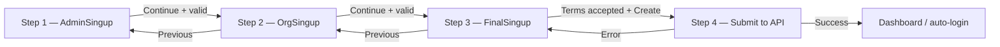

# EMS Signup Flow — Validation, Errors & Tracking Checklist

Date: 2026-07-20

This document describes the full admin + organization signup wizard: step flow, validation rules, error handling, edge cases, and implementation checklists.

---

## Flow overview



| Step | `stepperCount` | Component | Action on continue |
|------|----------------|-----------|-------------------|
| 1 | `1` | `AdminSingup.tsx` | Save personal fields → `formContext` → go to step 2 |
| 2 | `2` | `OrgSingup.tsx` | Save org fields → `formContext` → go to step 3 |
| 3 | `3` | `FinalSingup.tsx` | User accepts terms → go to step 4 |
| 4 | `4` | *(not built yet)* | `POST /api/auth/register` → handle response |

**State storage**
- Wizard step: `stepperContext` (`stepperCount`, `setStepCount`)
- Form payload: `formContext` (`formData`, `updateFormData`)
- Step-local UI state stays in each page component (password visibility, slug touched, terms checkbox)

---

## Step 1 — Owner / personal information

**File:** `src/pages/auth/AdminSingup.tsx`

**Fields collected**

| UI field | Context key | Required |
|----------|-------------|----------|
| Full name | `fullName` | Yes |
| Email | `email` | Yes |
| Phone | `phoneNumber` *(mapped from local `phone`)* | Yes |
| Password | `password` | Yes |
| Confirm password | `confirmPassword` | Yes |

### Frontend validation (format only — UX)

| Field | Rule | Suggested regex / logic | Error message |
|-------|------|-------------------------|---------------|
| Full name | Letters, spaces, hyphens, apostrophes; min 2 chars after trim | `/^[A-Za-z]+(?:[ '-][A-Za-z]+)*$/` | Enter a valid full name (letters, spaces, hyphens only) |
| Email | Valid email format | `/^[^\s@]+@[^\s@]+\.[^\s@]+$/` | Enter a valid email address |
| Phone | **Local numbers only** — exactly 10 digits | Strip non-digits → `/^\d{10}$/` | Enter a valid 10-digit local phone number |
| Password | Min 12 chars; upper, lower, number, symbol | See backend guide | Use 12+ characters with upper, lower, number, and symbol |
| Confirm password | Must match password | `password === confirmPassword` | Passwords do not match |

**UX rules**
- [ ] Show inline error only after user has typed in the field (avoid errors on empty initial state)
- [ ] Disable **Continue** until all step-1 fields pass format validation
- [ ] Optional: auto-format phone as `(555) 000-0000` while typing
- [ ] Do **not** check email/phone uniqueness on frontend — backend owns that

### Backend validation (authoritative)

| Check | On failure — suggested API response | UI handling |
|-------|-------------------------------------|-------------|
| All fields present & correct types | `400` + field errors | Map to inline or toast errors |
| Email unique | `409` or `400` `{ field: "email" }` | Show under email field |
| Phone unique | `409` or `400` `{ field: "phoneNumber" }` | Show under phone field |
| Password strength (≥ 12, complexity) | `400` `{ field: "password" }` | Show under password field |
| Password hash never returned in response | — | Never log or store plain password after submit |

### Edge cases — Step 1

| Case | Expected behavior |
|------|-------------------|
| Empty field on Continue | Block navigation; show field error |
| Leading/trailing spaces in name/email | Trim before validate & before save to context |
| Phone with formatting `(555) 000-0000` | Normalize to digits before validate/submit |
| Phone with country code `+1...` | Reject on frontend (local only policy) |
| Password visible via eye toggle | Must not affect validation |
| Copy-paste mismatch in confirm password | Show mismatch error |
| User clicks **Login** NavLink mid-flow | Navigate away; wizard state may reset (document or persist intentionally) |
| Browser autofill | Ensure controlled inputs still validate after autofill |
| Very long inputs (>128 chars password, etc.) | Enforce max length client + server |

### Step 1 checklist

- [ ] Create `src/utils/validator.ts` (or hook) with step-1 rules
- [ ] Wire `useValidator` / `validateAdminSingup` in `AdminSingup.tsx`
- [ ] Map `phone` → `phoneNumber` in `updateFormData`
- [ ] Inline errors on all 5 fields
- [ ] `disabled={!canSubmit}` on Continue button
- [ ] Trim strings before saving to context

---

## Step 2 — Organization information

**File:** `src/pages/auth/OrgSingup.tsx`

**Fields collected**

| UI field | Context key *(expected)* | Current local state | Required |
|----------|--------------------------|---------------------|----------|
| Organization name | `organizationName` | `orgName` | Yes |
| Organization slug | `organizationSlug` | `slug` | Yes |
| Address | `address` | `address` | Yes |
| Company size | `companySize` | `companySize` (number `1`, Select not wired) | Yes |

> **Known gap:** `OrgSingup` saves `{ orgName, slug, ... }` but `formContext` expects `{ organizationName, organizationSlug, ... }`. Fix mapping before API submit.

### Frontend validation (format only)

| Field | Rule | Suggested regex / logic | Error message |
|-------|------|-------------------------|---------------|
| Organization name | 3–100 chars; letters, numbers, common punctuation | `/^[A-Za-z0-9&().,' -]{3,100}$/` | Enter a valid organization name (3–100 characters) |
| Organization slug | Lowercase, numbers, hyphens; no leading/trailing hyphen | `/^[a-z0-9]+(?:-[a-z0-9]+)*$/` | Use lowercase letters, numbers, and hyphens only |
| Address | 5–255 chars; allowed address characters | `/^[A-Za-z0-9\s,.'#/-]{5,255}$/` | Enter a valid address (at least 5 characters) |
| Company size | Must be selected from list | One of predefined options | Select a company size |

**Slug auto-generation**
- [ ] Auto-slugify from org name when user has **not** manually edited slug (`slugTouched === false`)
- [ ] Once user edits slug, stop auto-overwriting
- [ ] Slugify: lowercase → replace non-alphanumeric runs with `-` → trim hyphens from ends
- [ ] Fix slug input `type="file"` → `type="text"`

**Optional UX**
- [ ] Debounced `GET /api/organizations/check-slug?slug=...` (300ms) — show "available" / "taken" hint only; server re-checks on submit

### Backend validation (authoritative)

| Check | On failure | UI handling |
|-------|------------|-------------|
| Organization name unique | `409` `{ field: "organizationName" }` | Error on org name |
| Slug unique | `409` `{ field: "organizationSlug" }` | Error on slug + suggest alternative |
| Address unique *(if enforced in model)* | `409` `{ field: "address" }` | Error on address |
| Company size valid number / enum | `400` | Error on select |

### Edge cases — Step 2

| Case | Expected behavior |
|------|-------------------|
| Org name changes after slug manually edited | Do not overwrite slug |
| Org name produces empty slug (e.g. `"!!!"`) | Block continue; prompt user to enter slug manually |
| Slug already taken (live check says taken) | Disable continue or warn; backend must reject anyway |
| User clicks **Previous** | Go to step 1; keep `formContext` data from step 1 |
| Company size not selected | Block continue |
| Special characters in org name | Slug strips them; preview updates `rosterly.app/your-org` |
| XSS in text fields | Escape on display in review step; sanitize server-side |

### Step 2 checklist

- [ ] Fix field name mapping to `formContext` keys
- [ ] Wire `Select` value + onChange for `companySize`
- [ ] Fix slug input type to `text`
- [ ] Add step-2 validator function
- [ ] Inline errors + disabled Continue until valid
- [ ] Optional slug availability debounce hook (`useDebounce.ts` already exists)

---

## Step 3 — Review & terms

**File:** `src/pages/auth/FinalSingup.tsx`

**Purpose**
- Display summary of steps 1 & 2 from `formContext`
- Require terms acceptance before submit

### Validation

| Rule | Error / behavior |
|------|------------------|
| Terms checkbox must be checked | Disable **Create organization** until `agreed === true` *(already implemented)* |
| All prior step data must exist in context | If missing, redirect to earliest incomplete step |
| Review rows must show actual values | Currently shows labels only — wire `formData` values |

**Review display checklist**

- [ ] `AuthReviewRow` for full name → `formData.fullName`
- [ ] Email → `formData.email`
- [ ] Phone → `formData.phoneNumber`
- [ ] Org name → `formData.organizationName`
- [ ] Slug → `formData.organizationSlug`
- [ ] Address → `formData.address`
- [ ] Company size → `formData.companySize`
- [ ] **Do not** show password or confirm password in review
- [ ] Edit buttons on review sections → `setStepCount(1)` or `setStepCount(2)`

### Edge cases — Step 3

| Case | Expected behavior |
|------|-------------------|
| User refreshes on review page | Restore from context or send back to step 1 |
| User opens terms modal | Modal closes without auto-checking terms |
| User clicks Previous | Return to step 2; keep all context data |
| Partial context (empty email) | Block create; show message + link to edit step |
| Double-click Create organization | Debounce / loading state; single API call only |

### Step 3 checklist

- [ ] Read `formData` from `useFormData()` in `FinalSingup.tsx`
- [ ] Pass values into each `AuthReviewRow`
- [ ] Wire Edit handlers on `AuthReviewSection`
- [ ] Guard: redirect if step 1/2 data incomplete
- [ ] Loading + disabled state on Create while API in flight

---

## Step 4 — API submit & response

**Trigger:** `setStepCount(4)` after terms accepted *(step 4 UI / submit handler not implemented yet)*

### Request payload (single combined POST)

**Endpoint:** `POST /api/auth/register`

```json
{
  "fullName": "Jordan Malik",
  "email": "jordan@company.com",
  "phoneNumber": "5550000000",
  "password": "SecurePass123!",
  "organizationName": "Acme Inc.",
  "organizationSlug": "acme-inc",
  "address": "123 Market Street, Austin, TX",
  "companySize": "11–50 employees"
}
```

> Send **normalized** phone (digits only). Do **not** send `confirmPassword` to the server.

### Backend processing (atomic)

1. Validate request shape (Zod/Joi)
2. Validate password strength
3. Check email uniqueness
4. Check phone uniqueness
5. Check organization slug uniqueness
6. Begin DB transaction
7. Hash password (bcrypt/argon2)
8. Create organization
9. Create admin/owner linked to organization
10. Commit transaction
11. Issue tokens (HttpOnly cookies) — auto-login owner
12. Return safe response (no password, no tokens in body)

### Success response handling

- [ ] Show success toast
- [ ] Store user in `currentUser` Redux slice (or session from cookies)
- [ ] Redirect to `/DashBoard`
- [ ] Reset wizard state (`stepperCount = 1`, clear `formContext`)

### Error response handling

| HTTP | Meaning | Frontend action |
|------|---------|-----------------|
| `400` | Validation failed | Map `errors[]` or `{ field, message }` to fields; stay on review or jump to step |
| `409` | Duplicate email / phone / slug / org name | Show specific field error; jump to relevant step |
| `500` | Server error | Generic toast: "Something went wrong. Try again." |
| Network offline | No response | Toast + retry button; do not clear form |
| Timeout | Request hung | Cancel + retry; keep form data |

### Edge cases — Step 4

| Case | Expected behavior |
|------|-------------------|
| Transaction fails mid-create | Backend rolls back; user sees error; no partial account |
| Email taken between step 1 and submit | `409` on email; navigate user to step 1 with error |
| Slug taken at submit time | `409` on slug; navigate to step 2 |
| User navigates back after failed submit | Preserve form data for correction |
| Success but redirect fails | Still show success; user can click Dashboard manually |

### Step 4 checklist

- [ ] Create signup API service (`src/services/auth.ts` or similar)
- [ ] Build step-4 submit handler in `FinalSingup` or dedicated hook
- [ ] Loading spinner on Create organization button
- [ ] Handle all HTTP error codes above
- [ ] Never send `confirmPassword` to API
- [ ] Clear sensitive data from memory after success
- [ ] Add success / error toasts (`react-hot-toast` already in `Layout`)

---

## Cross-cutting validation & security

### Principles

1. **Frontend validates format for UX only** — backend is always authoritative
2. **Never trust client** for uniqueness, password strength final check, or authorization
3. **Never return** password hash, refresh token, or internal IDs unnecessarily
4. **Trim** all string inputs before validate and submit
5. **Debounce** async checks (slug, email) — use `useDebounce.ts` (300ms recommended)

### Security edge cases

| Threat | Mitigation |
|--------|------------|
| Email enumeration | Same generic message where possible; identical response timing |
| Password in logs | Never `console.log` form data in production |
| CSRF on register | SameSite cookies + CSRF token if not using pure JWT cookie pattern |
| Rate limiting | Backend throttle on `/register`; frontend disable button after submit |
| XSS in review step | React escapes by default; avoid `dangerouslySetInnerHTML` |

---

## Master implementation checklist

### Infrastructure

- [ ] `src/utils/validator.ts` — shared regex + helpers (`fieldError`, `normalizePhone`, `formatLocalPhone`)
- [ ] `src/hooks/useValidator.tsx` — step-1 boolean validation hook
- [ ] `src/hooks/useOrgValidator.tsx` — step-2 validation hook *(optional separate file)*
- [ ] `useDebounce.ts` — for slug/email async checks

### Step pages

- [ ] Step 1 — validation + errors + disabled Continue
- [ ] Step 2 — field mapping fix + Select wired + validation
- [ ] Step 3 — review values from context + edit links + guards
- [ ] Step 4 — API call + loading + error mapping + redirect

### Context / data integrity

- [ ] Align `OrgSingup` keys with `formContext` (`organizationName`, `organizationSlug`)
- [ ] Validate context completeness before step 3 and before API submit
- [ ] Decide: reset wizard on route leave or persist in `sessionStorage`

### Testing checklist (manual)

- [ ] Happy path: all valid data → account created → dashboard
- [ ] Invalid email format → blocked step 1
- [ ] Password mismatch → blocked step 1
- [ ] 10-digit phone invalid → blocked step 1
- [ ] Empty org name → blocked step 2
- [ ] Duplicate slug (backend) → error shown, user can fix
- [ ] Duplicate email (backend) → error shown on step 1 or review
- [ ] Terms not checked → Create disabled
- [ ] Previous/Continue navigation preserves data
- [ ] Double submit does not create duplicate accounts

---

## Current codebase status (as of 2026-07-20)

| Item | Status |
|------|--------|
| Wizard routing (`Singup.tsx` steps 1–3) | Done |
| `formContext` + `stepperContext` | Done |
| Step 1 validation | **Not implemented** — user to add |
| Step 2 validation | **Not implemented** — user to add |
| Step 2 → context field mapping | **Broken** — key mismatch |
| Step 3 review values | **Not wired** — labels only |
| Step 4 API submit | **Not implemented** |
| Terms gate on Create | Done |
| Backend register endpoint | Refer to `backend/docs/employee-management-system-implementation-guide.md` |

---

## Quick reference — suggested validator module shape

```ts
// src/utils/validator.ts (to implement)

export function validateAdminSignup(fields): {
  isFullNameValid: boolean
  isEmailValid: boolean
  isPhoneNumberValid: boolean
  isPasswordValid: boolean
  isConfirmPasswordValid: boolean
  isValid: boolean
}

export function validateOrgSignup(fields): {
  isOrganizationNameValid: boolean
  isOrganizationSlugValid: boolean
  isAddressValid: boolean
  isCompanySizeValid: boolean
  isValid: boolean
}

export function fieldError(value: string, isValid: boolean, message: string): string
export function normalizePhone(phone: string): string
export function formatLocalPhone(phone: string): string
```

Use this document as the single tracking source while implementing validation and signup end-to-end.

---

## Step-by-step tracking board

Use this section as your main progress tracker. Work top to bottom; check each box when done.

### Phase 0 — Setup & shared utilities

- [ ] **0.1** Create `src/utils/validator.ts` with regex rules for step 1 and step 2
- [ ] **0.2** Add helpers: `fieldError()`, `normalizePhone()`, `formatLocalPhone()`
- [ ] **0.3** Create `src/hooks/useValidator.tsx` for step 1 (returns booleans + `canSubmit`)
- [ ] **0.4** Create `src/hooks/useOrgValidator.tsx` for step 2 *(optional separate hook)*
- [ ] **0.5** Confirm `src/hooks/useDebounce.ts` exists for async slug/email checks (300ms)

---

### Phase 1 — Step 1: Personal information (`AdminSingup.tsx`)

- [ ] **1.1** Import validator hook/util into `AdminSingup.tsx`
- [ ] **1.2** Validate full name (letters, spaces, hyphens only)
- [ ] **1.3** Validate email format
- [ ] **1.4** Validate phone — local 10-digit only; strip/format input
- [ ] **1.5** Validate password — min 12 chars, upper, lower, number, symbol
- [ ] **1.6** Validate confirm password matches password
- [ ] **1.7** Show inline error under each field (only after user types)
- [ ] **1.8** Disable **Continue** until all fields valid (`canSubmit`)
- [ ] **1.9** Trim strings before calling `updateFormData`
- [ ] **1.10** Map `phone` → `phoneNumber` when saving to `formContext`
- [ ] **1.11** Test edge cases: empty fields, spaces, autofill, password toggle

---

### Phase 2 — Step 2: Organization information (`OrgSingup.tsx`)

- [ ] **2.1** Fix slug input `type="file"` → `type="text"`
- [ ] **2.2** Wire `Select` — bind `value` and `onChange` for `companySize`
- [ ] **2.3** Fix `updateFormData` mapping: `orgName` → `organizationName`, `slug` → `organizationSlug`
- [ ] **2.4** Validate organization name (3–100 chars)
- [ ] **2.5** Validate organization slug (lowercase, numbers, hyphens)
- [ ] **2.6** Validate address (5–255 chars)
- [ ] **2.7** Validate company size is selected
- [ ] **2.8** Keep auto-slugify when `slugTouched === false`
- [ ] **2.9** Stop auto-slugify after user manually edits slug
- [ ] **2.10** Show inline errors on all step-2 fields
- [ ] **2.11** Disable **Continue** until step 2 valid
- [ ] **2.12** *(Optional)* Debounced slug availability check API
- [ ] **2.13** Test edge cases: empty slug from special chars, Previous button keeps step 1 data

---

### Phase 3 — Step 3: Review & terms (`FinalSingup.tsx`)

- [ ] **3.1** Read `formData` from `useFormData()` in `FinalSingup.tsx`
- [ ] **3.2** Display full name in review row
- [ ] **3.3** Display email in review row
- [ ] **3.4** Display phone number in review row
- [ ] **3.5** Display organization name in review row
- [ ] **3.6** Display organization slug in review row
- [ ] **3.7** Display address in review row
- [ ] **3.8** Display company size in review row
- [ ] **3.9** Do **not** show password or confirm password in review
- [ ] **3.10** Wire **Edit** on owner section → `setStepCount(1)`
- [ ] **3.11** Wire **Edit** on organization section → `setStepCount(2)`
- [ ] **3.12** Guard: if step 1/2 data missing, redirect to incomplete step
- [ ] **3.13** Confirm terms checkbox gates **Create organization** *(already done)*
- [ ] **3.14** Test edge cases: refresh page, double-click Create, open/close terms modal

---

### Phase 4 — Step 4: API submit & finish

- [ ] **4.1** Create `src/services/auth.ts` (or API helper) for signup
- [ ] **4.2** Build submit handler — collect full `formData` payload
- [ ] **4.3** Normalize phone to digits only before POST
- [ ] **4.4** Exclude `confirmPassword` from request body
- [ ] **4.5** Call `POST /api/auth/register` on **Create organization**
- [ ] **4.6** Add loading state — disable button + show spinner during request
- [ ] **4.7** Handle `400` validation errors — map to fields / toast
- [ ] **4.8** Handle `409` duplicate errors — email, phone, slug, org name
- [ ] **4.9** Handle `500` and network/timeout errors — generic toast + retry
- [ ] **4.10** On success — show toast, save user session, redirect to `/DashBoard`
- [ ] **4.11** On success — reset `stepperCount` and clear `formContext`
- [ ] **4.12** Prevent double submit (debounce or `isSubmitting` flag)
- [ ] **4.13** Never log plain password in console

---

### Phase 5 — Backend (authoritative validation)

- [ ] **5.1** Implement `POST /api/auth/register` endpoint
- [ ] **5.2** Schema validate all request fields (Zod/Joi)
- [ ] **5.3** Enforce password strength server-side (≥ 12 chars)
- [ ] **5.4** Check email uniqueness
- [ ] **5.5** Check phone uniqueness
- [ ] **5.6** Check organization slug uniqueness
- [ ] **5.7** Use DB transaction — create org + admin atomically
- [ ] **5.8** Hash password (bcrypt/argon2)
- [ ] **5.9** Link admin to organization
- [ ] **5.10** Return response without password or sensitive tokens in body
- [ ] **5.11** Set HttpOnly auth cookies (auto-login owner)
- [ ] **5.12** *(Optional)* `GET /api/organizations/check-slug?slug=...`

---

### Phase 6 — Manual QA (final sign-off)

- [ ] **6.1** Happy path end-to-end: signup → dashboard
- [ ] **6.2** Invalid email blocked on step 1
- [ ] **6.3** Password mismatch blocked on step 1
- [ ] **6.4** Invalid phone blocked on step 1
- [ ] **6.5** Empty org fields blocked on step 2
- [ ] **6.6** Duplicate email from backend shows correct error
- [ ] **6.7** Duplicate slug from backend shows correct error
- [ ] **6.8** Terms unchecked → Create disabled
- [ ] **6.9** Previous / Continue preserves form data across steps
- [ ] **6.10** Double submit does not create duplicate accounts
- [ ] **6.11** Run `npx tsc --noEmit` — pass
- [ ] **6.12** Run `npm run build` — pass
- [ ] **6.13** Run `npm run lint` — pass

---

### Progress summary

| Phase | Description | Done |
|-------|-------------|------|
| 0 | Setup & utilities | ☐ |
| 1 | Step 1 — Personal info | ☐ |
| 2 | Step 2 — Organization info | ☐ |
| 3 | Step 3 — Review & terms | ☐ |
| 4 | Step 4 — API submit | ☐ |
| 5 | Backend validation | ☐ |
| 6 | Manual QA | ☐ |

**Overall signup flow complete:** ☐

